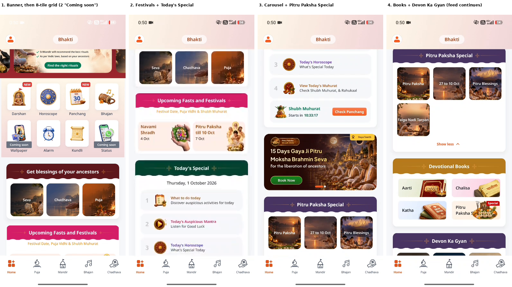
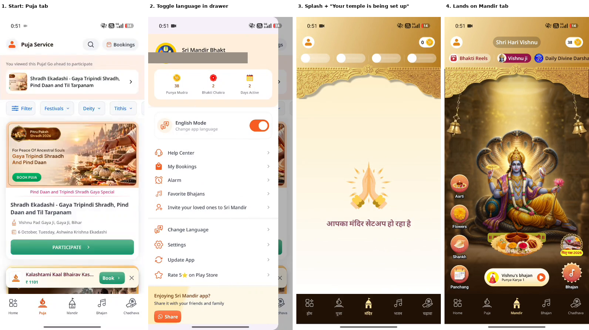
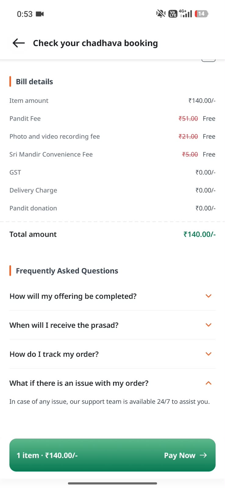
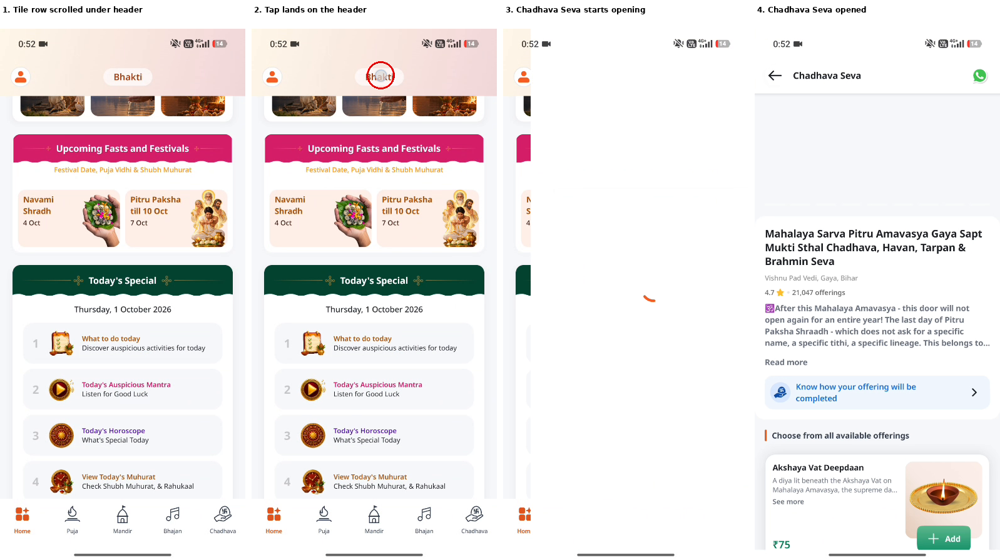

# Product Teardown: Sri Mandir

**Scope:** Home information architecture, vernacular continuity, checkout and support trust, and a scored, sequenced roadmap.
**Method:** ~30-minute hands-on audit + Play Store review reading + public business data. Every finding is labelled by evidence level (see the Evidence Log). Numbers marked *assumption* are to be calibrated against real baselines.

---

## 1. Summary

Sri Mandir is a fast-growing devotional app: 40M+ downloads claimed, ~3.5M MAUs, and paid conversion the founder says rose from 0.5% (2020) to 3.3%, with 6–7% among new users ([Inc42](https://inc42.com/startups/can-appsforbharat-build-the-uber-or-airbnb-for-indias-spiritual-tech-market/)). Growth is not the problem. The question is whether **friction at high-intent moments** (home discovery, checkout, post-booking support) leaves conversion on the table.

**Thesis:** the home screen serves devotion content and transactions at the same level, the checkout language experience may break for vernacular users, and support and post-booking pathways are unclear. All three sit on the booking funnel, where the business earns.

**What I'd do first** (details in Section 6): fix the sticky-header touch pass-through, route the support CTA to real support, and verify/fix checkout language continuity. Then A/B test a segmented home.

---

## 2. Business Context

| Fact | Source |
| --- | --- |
| 40M+ downloads (company claim); 1.2M users did 5.2M online pujas and offerings across 70+ temples in a year | [Entrackr](https://entrackr.com/news/appsforbharat-raises-20-mn-in-series-c-round-9451578) |
| ~3.5M MAU; paid conversion 3.3% overall, 6–7% for new users | [Inc42](https://inc42.com/startups/can-appsforbharat-build-the-uber-or-airbnb-for-indias-spiritual-tech-market/) |
| ~20% of revenue from diaspora (US, UK, UAE, Canada, Australia, NZ); India users split evenly between tier-1 and tier-2 towns; 30% under 35 | [TechCrunch](https://techcrunch.com/2025/06/30/sri-mandir-keeps-investors-hooked-as-digital-devotion-grows) |
| FY25 revenue claimed at INR 82.2 Cr, EBITDA loss INR 35.5 Cr | [Inc42](https://inc42.com/startups/can-appsforbharat-build-the-uber-or-airbnb-for-indias-spiritual-tech-market/) |

**Implication:** with ~3.3% paid conversion, small funnel improvements are worth real money, and revenue-bearing surfaces (banners, tiles) cannot be removed casually. Any IA change must be A/B tested against GMV, not just engagement.

### Competitive frame

| Player | Monetization model | What to benchmark |
| --- | --- | --- |
| **Sri Mandir** | Per-puja/chadhava bookings + content | Booking funnel, post-booking delivery |
| **Vama** | Per-puja pricing, virtual puja, astrology, prasad delivery ([Outlook Business](https://www.outlookbusiness.com/explainers/indias-love-for-religion-astrology-births-35-billion-industry)) | Home structure, pricing transparency |
| **Astrotalk** | ~90% revenue from paid one-on-one consultations ([Outlook Business](https://www.outlookbusiness.com/explainers/indias-love-for-religion-astrology-births-35-billion-industry)) | Different model; benchmark support and trust UX only |

*Gap: I have not yet screen-audited Vama's home or checkout. That comparison is listed in Section 9.*

---

## 3. Segments

| Segment | Job to be done | Key need | Evidence level |
| --- | --- | --- | --- |
| Daily devotees | Darshan, aarti, panchang | Low clutter, large text, audio | Assumption (review quotes only) |
| Intent-driven bookers | Book a puja/chadhava for an occasion | Clear pricing, proof, fast checkout | Supported: core revenue path |
| Diaspora bookers | Proxy puja for family/temples in India | Trust, delivery proof, English + vernacular | Supported: ~20% of revenue (TechCrunch) |
| Casual browsers | Reels, temple stories | Discovery, sharing | Assumption |

The "elderly vernacular" persona is an **assumption**: public data shows a 30% under-35 base and a tier-1/tier-2 split. Validate with in-app age and language cuts before designing for it.

---

## 4. Evidence Log

| # | Finding | Source | Confidence | Status |
| --- | --- | --- | --- | --- |
| F1 | Home is a long stack of ~9 sections with roughly 30 tappable elements before the end of the recorded scroll; promotional banner first, daily-devotion shortcuts (Darshan, Panchang) are small tiles below it | Audit + [screen recording](evidence/F1-home-scroll.mp4), [stills](evidence/F1-home-scroll-stills.png) | High | Captured. Audited during Pitru Paksha (1 Oct 2026), so density is partly seasonal |
| F11 | 2 of the 8 quick-access tiles (Wallpaper, Status) are "Coming soon" dead ends | Same recording | High | Captured |
| F2 | "Devon Ka Gyan" and "Bhakti Reels" lead to overlapping video feeds | Audit | Medium | Screenshot pending |
| F3 | Home and reviews describe the UI as crowded | Play Store reviews | Medium | Review tally pending |
| F4 | Checkout appears in English after selecting Hindi | Audit | Medium | Screen recording pending; see note in Problem 2 |
| F5 | Text inside promotional banners doesn't scale with OS font size | Audit | Medium | Test on device at 1.3x font scale pending |
| F6 | Switching language (profile drawer, "English Mode" toggle) replays a splash and "Your temple is being set up" screen (~3-4 s), then drops the user on the **Mandir** tab wherever they were (Puja, Bhajan) | Audit + [screen recording](evidence/F6-language-switch-reset.mp4), [stills](evidence/F6-language-switch-stills.png) | High (reproduced in both directions) | Captured. Root cause still unknown |
| F10 | Two language controls in the same drawer: a binary "English Mode" toggle and a separate "Change Language" item | Same recording | Medium | Overlap/intent to confirm |
| F7 | Taps on the sticky header fall through to content hidden beneath it (touch pass-through): a tap on the header opened Chadhava Seva because the Chadhava tile was scrolled under the header | [Screen recording](evidence/F7-sticky-header-taps.mp4), [stills](evidence/F7-header-touch-through-stills.png) | High (reproduced on video) | Captured. Earlier header taps with nothing beneath did nothing, consistent with pass-through |
| F8 | Floating WhatsApp icon opens a share sheet, not support | Audit | Medium | Mechanism is **inferred**, not verified |
| F9 | The "What if there is an issue with my order?" FAQ on the chadhava booking review screen says support is available 24/7 but gives no chat, call or email entry | Audit + [screenshot](evidence/F9-chadhava-booking-faq.jpg) | High | Captured |

---

## 5. Problems, Hypotheses, Solutions

### Problem 1: Home information architecture (F1, F2, F3)

**Observation.** Devotion content, transactions and media compete at equal weight on the home screen. Two entries (Devon Ka Gyan, Bhakti Reels) overlap.

**Observed in the recording** (Android, 1 Oct 2026, Home tab scrolled top to bottom): a promotional "Which rituals are best for your ancestors?" banner; an 8-tile shortcut grid (Darshan, Horoscope, Panchang, Bhajan, Wallpaper, Alarm, Kundli, Status), two of them marked "Coming soon"; "Get blessings of your ancestors" (Seva / Chadhava / Puja); Upcoming Fasts and Festivals; Today's Special (4 items plus Shubh Muhurat); a booking banner carousel; Pitru Paksha Special with an expandable tithi list; Devotional Books; Devon Ka Gyan. The recording ends before the feed does. Devon Ka Gyan sits on Home while "Bhakti Reels" is a chip on the Mandir tab; the overlap between them still needs its own capture (F2).



**Hypothesis.** Separating "daily devotion" from "book a puja" and merging duplicate media entries lowers time to first action and raises puja-page views from home. *(Assumption: +5–10% relative lift in home → puja-page rate; calibrate against the real baseline.)*

**Proposal.** Test a segmented home (A/B):

```
Current (flat)                         Test variant
┌────────────────────────┐            ┌────────────────────────┐
│ 30+ tiles, equal weight│    ──►     │ Tab 1: Daily Devotion  │
│ banners, reels, pujas, │            │ Tab 2: Pujas & Chadhava│
│ panchang, astrology... │            │ Tab 3: Media (merged)  │
└────────────────────────┘            └────────────────────────┘
```

**Risk.** Banners and tiles drive revenue today. Moving pujas behind a tab could *reduce* GMV for users who buy from home impulse. Guardrail: revenue per home-session must not fall by more than a pre-set threshold.

**Seasonality caveat.** The recording was made during Pitru Paksha, and most of the home (the lead banner, "Get blessings of your ancestors", the carousel, Pitru Paksha Special, a Pitru Paksha book) is festival merchandising. Part of the density is deliberate seasonal promotion, which is also where peak-season revenue comes from. So the test should not remove that merchandising; it should test *placement* (for example, keeping daily-devotion shortcuts above the fold). Capture the same scroll in an off-peak week before generalizing.

### Problem 2: Vernacular continuity (F4, F5, F6)

**Observation.** After selecting Hindi, checkout appeared in English; banner text is baked into images; changing language resets the screen.

**Checkout language: verify before building.** Razorpay's documentation says checkout fields default to English, the default language is set in the merchant **Dashboard** (account level), and customers can switch language manually inside checkout ([Razorpay docs](https://razorpay.com/docs/payment-gateway/web-integration/standard/local-lang/)). I found no documented per-session `language` option for the app SDKs, so **do not assume one exists**. Options to evaluate with Sri Mandir's payments team:
1. Set the account default language (only helps if the user base is mostly one language).
2. Confirm with Razorpay support whether the native SDK accepts a per-session locale.
3. If neither works, build a native pre-checkout order summary in the user's language so the gateway screen is the only English step.

**Banners.** Replace text-in-image with native text layers over background art, so Dynamic Type / font scale is respected (F5).

**State on language switch (F6, F10).** Captured on Android (1 Oct 2026). Toggling language from the profile drawer triggers a full relaunch-style sequence (splash, then "Your temple is being set up", ~3-4 s) and lands the user on the Mandir tab, not the tab they were on. It did this from both the Puja and Bhajan tabs, and in both directions (English to Hindi and back). Likely cause (hypothesis): the app re-creates its root view after a locale change. Fix direction: apply the locale in place, or restore the previous tab and scroll position after the switch. Separately, the drawer has both an "English Mode" toggle and a "Change Language" item; confirm whether they overlap and whether the toggle covers languages other than English and Hindi.



**Hypothesis.** Fixing checkout language continuity improves checkout → payment conversion for Hindi users. *(Assumption: +0.2–0.5 pp on that step; calibrate against baseline split by `app_language`.)*

### Problem 3: Support and post-booking trust (F7, F8, F9)

**Observation.**

| User expectation | Observed behavior |
| --- | --- |
| Tapping the floating WhatsApp icon opens support chat | Opens a share sheet (mechanism inferred; likely a share intent) |
| Booking-screen FAQ says "support team is available 24/7" and leads to a contact path | Plain text only: no link, number or chat entry (see screenshot) |
| After paying, user knows what happens next | No visible timeline for video delivery or prasad |



*Chadhava booking review screen (Android, 1 Oct 2026). The support answer is text only. Note what works here: the itemized bill shows Pandit fee, recording fee and convenience fee struck through as "Free", which makes the price easy to read and is worth keeping. The FAQ also already asks about prasad timing and order tracking; I have not opened those answers, so whether they give concrete timelines is unchecked.*

Also (F7, reproduced): taps on the sticky header fall through to content hidden beneath it. In the recording, a tap on the header opened Chadhava Seva because the Chadhava tile had been scrolled under the header. Users get sent to a page they didn't choose.




**Proposal.**
- Replace the floating icon with a support icon that opens real support; label sharing separately ("Share with family").
- Add a post-booking timeline card: Registered → Sankalp details → Video delivered (set an honest SLA) → Prasad dispatched.
- Make the sticky header consume touches so taps on it never reach content hidden beneath (F7).

**Hypothesis.** Clear post-booking expectations and a working support path reduce support tickets per booking and "where is my video" contacts. *(Assumption: -10–20% tickets per booking; calibrate against current ticket taxonomy.)*

---

## 6. Prioritization (RICE)

Reach 1–10 (share of users affected), Impact 0.25–3, Confidence %, Effort in person-weeks. **All scores are my estimates**, to be replaced with team data.

| Initiative | Reach | Impact | Conf. | Effort | RICE |
| --- | --- | --- | --- | --- | --- |
| Support CTA reroute + icon | 6 | 1 | 80% | 1 | **4.8** |
| Checkout language continuity (after feasibility check) | 4 | 2 | 50% | 1 | **4.0** |
| Sticky-header touch pass-through | 5 | 1 | 70% | 1 | 3.5 |
| Post-booking timeline card | 4 | 2 | 70% | 3 | 1.9 |
| Segmented home A/B | 10 | 2 | 50% | 8 | 1.3 |
| Native-text banners | 7 | 1 | 60% | 4 | 1.1 |
| Preserve state on language switch | 2 | 1 | 60% | 2 | 0.6 |
| Merge media entries | 5 | 0.5 | 70% | 3 | 0.6 |
| Senior "Easy Mode" | 3 | 2 | 40% | 6 | 0.4 |
| Vernacular voice search | 3 | 1 | 30% | 10 | 0.1 |

**Sequence**
- **Now (first 2 sprints):** sticky-header touch pass-through, support CTA, checkout language feasibility and fix.
- **Next:** post-booking timeline; segmented home A/B with a revenue guardrail.
- **Later, only if data supports it:** banners, state preservation, media merge.
- **Parked:** Easy Mode, voice search. Validate the elderly-segment assumption first.

---

## 7. Metrics

| Area | Primary metric | Guardrail | Cut by |
| --- | --- | --- | --- |
| Home IA | Home → puja-page rate; time to first action | GMV per home session, DAU/MAU | New vs returning, language |
| Checkout language | Checkout initiated → payment success | Gateway cancel / back-nav rate | `app_language`, UPI vs card |
| Support and trust | Support tickets per booking; refund rate | Booking conversion | Domestic vs diaspora |
| Accessibility | Aarti/panchang read depth at font scale > 1.2x | Uninstalls after font-scale change | OS font scale |

Anchor: the only public baseline is the overall 3.3% paid conversion; everything else needs internal data.

### Experiment note
Segmented-home test: randomize at user level, run ≥ 2 full weekly cycles plus one festival-free window (festival weeks distort booking behavior), and size with a power calculation against the real baseline before launch.

---

## 8. SQL Cookbook

*Generic Postgres-style SQL; adjust date functions for BigQuery/Snowflake.*

### Q1: Puja funnel by app language (last 30 days, session-level)

```sql
SELECT
    app_language,
    COUNT(DISTINCT CASE WHEN event_name = 'puja_page_viewed'       THEN session_id END) AS viewed,
    COUNT(DISTINCT CASE WHEN event_name = 'puja_checkout_initiated' THEN session_id END) AS checkout,
    COUNT(DISTINCT CASE WHEN event_name = 'payment_success'         THEN session_id END) AS paid
FROM app_analytics_events
WHERE event_timestamp >= CURRENT_DATE - INTERVAL '30 days'
GROUP BY app_language;
-- Compute checkout/viewed and paid/checkout per language. Not a strictly ordered funnel;
-- use a per-session step-order check if event ordering matters.
```

### Q2: 30-day repeat-booking rate by first-booking cohort

```sql
WITH ranked AS (
    SELECT user_id, booking_date,
           ROW_NUMBER() OVER (PARTITION BY user_id ORDER BY booking_date) AS rn
    FROM app_bookings
    WHERE status = 'SUCCESS'
),
firsts  AS (SELECT user_id, booking_date AS first_date  FROM ranked WHERE rn = 1),
seconds AS (SELECT user_id, booking_date AS second_date FROM ranked WHERE rn = 2)
SELECT
    DATE_TRUNC('month', f.first_date) AS cohort_month,
    COUNT(*) AS first_time_bookers,
    COUNT(CASE WHEN s.second_date <= f.first_date + INTERVAL '30 days' THEN 1 END) AS repeat_within_30d,
    ROUND(100.0 * COUNT(CASE WHEN s.second_date <= f.first_date + INTERVAL '30 days' THEN 1 END)
          / COUNT(*), 2) AS repeat_30d_pct
FROM firsts f
LEFT JOIN seconds s USING (user_id)
WHERE f.first_date <= CURRENT_DATE - INTERVAL '30 days'   -- only cohorts with a full 30-day window
GROUP BY 1
ORDER BY 1;
```

---

## 9. Open Items (what would move this from good to strong)

- [x] F6 screen recording and stills captured (Android)
- [x] F1 home-scroll recording and stills captured (Android)
- [x] F9 screenshot captured (Android)
- [ ] Open and capture the answers to the 3 collapsed FAQs (prasad timing, tracking, offering completion)
- [ ] Annotated screenshots for the remaining findings (F2–F5, F7–F8)
- [ ] Repeat the home scroll in an off-peak (non-festival) week, with app version and date captured
- [ ] Review tally: theme counts from the most recent ~500 Play Store reviews
- [ ] Screen-audit Vama's home and checkout for the competitor table
- [ ] Confirm the checkout language behavior on a clean install in Hindi (screen recording)
- [x] F7 reproduced on video (Android)
- [ ] Reproduce F8 with exact steps and device/OS

---

*Sources: Inc42, Entrackr, TechCrunch, Outlook Business, Razorpay docs (linked inline). Company figures are company claims as reported by the press.*
